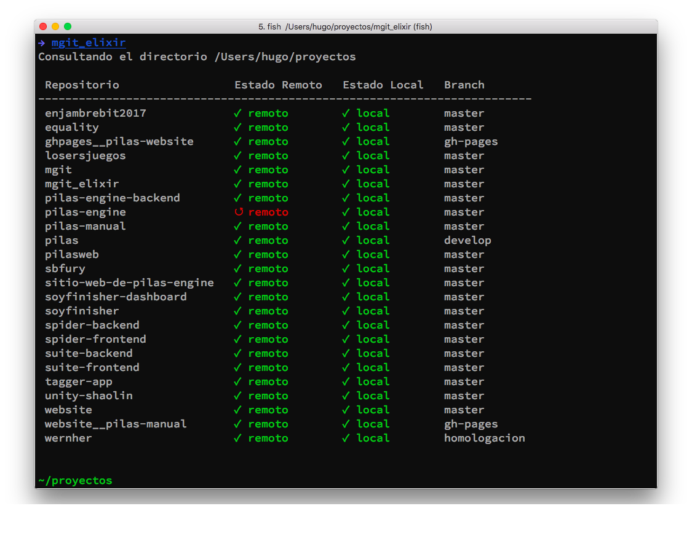

# MgitElixir

Versión alternativa de este software: https://github.com/hugoruscitti/mgit

Esta es una herramienta muy sencilla para consultar el estado de tus copias locales de repositorios.

El comando mgit listará todos los repositorio en el directorio actual junto con algunos indicadores para resolver estas consultas:

¿El repositorio está actualizado?.
¿Cuantos cambios remotos debería traer?
¿Hay archivos modificados que aún no se incluyeron en commits?

